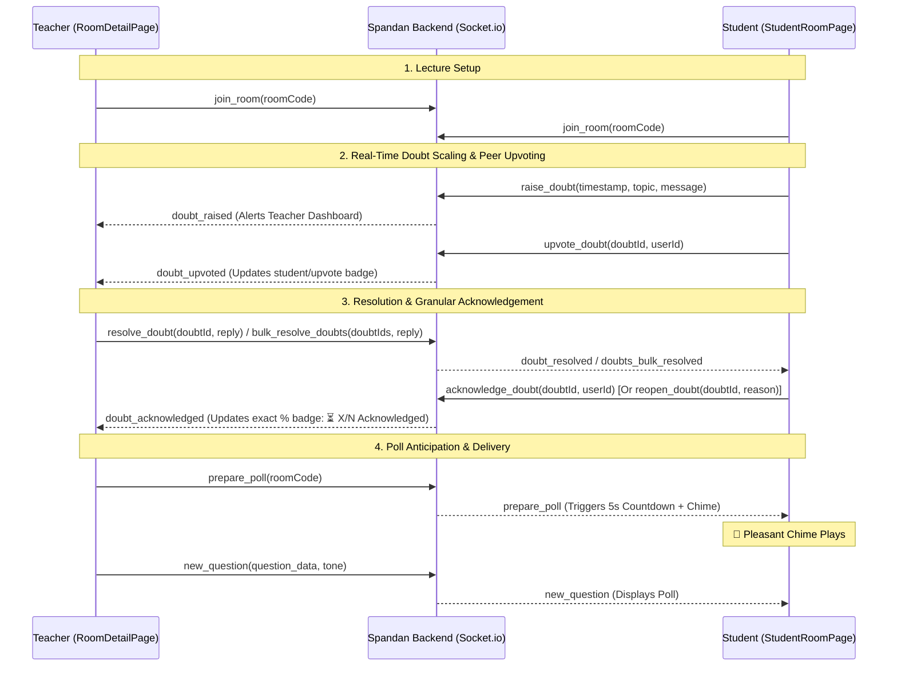

# Spandan Context & Architecture 🚀

This document outlines the core architecture and feature extensions implemented in the **Spandan Classroom Engagement System**. It provides a clear, high-level overview of how the system operates and details the specific psychological and UI/UX features integrated into the platform.

---

## 🏗️ Core Architecture Flow

Spandan operates on a real-time WebSocket architecture connecting the Teacher and Student clients through a centralized Node.js/Express server. 

---

## ✨ Intern Implementation Contributions

The following major features were implemented to enhance the psychological engagement and frictionless communication within the classroom.

### 1. 🎭 AI Question Tone & Mood Selector
**Problem:** Auto-generated questions can feel robotic and monotonous, leading to student disengagement.
**Solution:**
- Integrated a `tone` parameter into the AI Prompt Engine (`services/questionService.js`).
- Teachers can now dynamically select the mood of the questions (e.g., *Casual, Sarcastic, Technical, Humorous*).
- **Impact:** Keeps the classroom atmosphere light and matches the teacher's current teaching style, significantly boosting attention retention.

### 2. 🎵 Anticipation Countdown & Chime (Sync Protocol)
**Problem:** Dropping a poll instantly onto student screens causes anxiety and jarring context-switching.
**Solution:**
- Built a 5-second synchronized delay between the Teacher approving a question and the question appearing.
- Implemented a Web Audio API synthesizer that plays a pleasant, calming C-major chord progression (inspired by classical Raagas).
- **Impact:** Conditions the students positively. The chime acts as a gentle auditory cue to transition their focus from listening to answering, entirely removing the "pop-quiz panic."

### 3. 🙋‍♂️ Advanced Real-Time Doubt Scaling & Resolution System
**Problem:** In large virtual or hybrid classrooms (300+ students), duplicate questions flood the instructor, and binary resolution closes out doubts before every student's specific nuance is clarified.
**Solution:**
- **Topic Clustering (`🗂️ Group by Topic`) & Bulk Resolution:** Doubts are categorized under tags (`#General`, `#Concept`, `#Formula`, `#Example`, etc.). Teachers can cluster questions and click **Select All in Topic** to send a single clarifying explanation to hundreds of students simultaneously. Single-student topics dynamically hide bulk checkboxes and offer a direct individual reply box.
- **Peer Upvoting (`👍 I have this doubt too`):** Students can upvote existing doubts instead of raising duplicates, instantly highlighting priority questions on the teacher dashboard with real-time badges (`👥 N students (👍 upvotes)`).
- **Per-Student Safety Valve & Exact Percentage Tracking:** When a doubt is answered, students independently confirm understanding (`👍 Got it, thanks!`) or re-open (`🙋 Re-Open`) if their nuance was missed. The teacher dashboard dynamically calculates exact student confirmation percentages:
  - `✔ Resolved (0/N acknowledged)`
  - `⏳ X/N Students Acknowledged (Y%)` displayed with a clear amber badge during partial confirmation.
  - `✅ All N Students Acknowledged (100%)` displayed in green once every participating student confirms.
- **Zero-Duplicate History:** Rigorous `Map`-based render deduplication across `RoomDetailPage.jsx` and backend `roomDoubtsStore` guarantees zero duplicate entries ever appear across tab refreshes.

---

## 🛠️ Technical Stack
- **Frontend:** React, Vite, Socket.io-client
- **Backend:** Node.js, Express, Socket.io
- **AI Engine:** MiniMax / Gemini (via API)
- **Audio:** Native Browser Web Audio API (Zero external assets)
