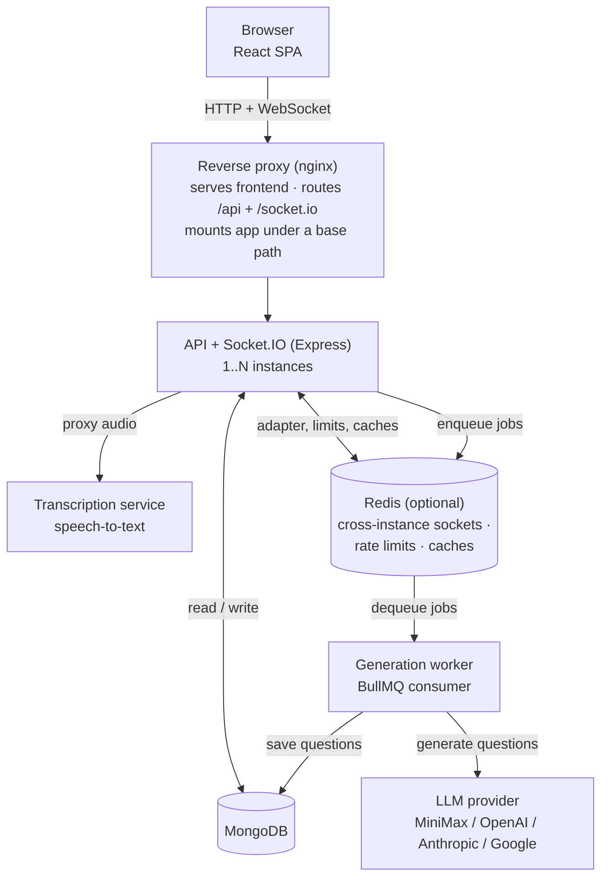

# Spandan

> Real-time classroom polling with LLM-generated questions from the live lecture transcript.

Spandan is a web platform for running live, interactive polls in classrooms and
presentations. A teacher speaks; the lecture audio is transcribed; a large
language model generates poll questions from that transcript; the teacher
approves them; students answer live on their own devices; and the room sees
results and a leaderboard update in real time. The goal is to keep large classes
engaged with low-friction, in-the-moment questions rather than after-the-fact
quizzes.

## What's new in this build

A batch of frontend feature work and fixes were added on top of the base
project. Everything below is implemented, tested, and running in the local setup
described in [Getting started](#getting-started).

### 1. Timer Progress Ring (`frontend/src/components/TimerRing.jsx`)
- Replaced the static countdown circle on the student room with an animated
  **SVG progress ring** that sweeps around the remaining-seconds number.
- Color transitions with the time remaining: **green** → **amber** (≤10s) →
  **red** (≤5s, shows "LEFT!").
- Dropped into `StudentRoomPage.jsx` and reused inside the question-preview modal.

### 2. "Time's Up" full-screen flash (`StudentRoomPage.jsx`)
- When a poll timer hits 0 the student gets a red full-screen **"⏰ TIME'S UP!"**
  overlay that flashes and fades over ~1.4s.
- Adds `navigator.vibrate([200, 80, 200])` on supporting devices.
- Fired from both question handlers (`handleQuestionStarted`, `handleNewQuestion`).

### 3. Dark Mode "Auto (System)" (`frontend/src/stores/themeStore.js`, `ThemeToggle.jsx`)
- Theme is now a 3-way choice: **☀️ Light / 🖥️ System / 🌙 Dark**.
- `system` follows the OS via `matchMedia('(prefers-color-scheme: dark)')` and
  updates **live** when the OS preference changes.
- `isDark` is still exposed as a plain boolean (the *effective* applied theme),
  so every existing consumer keeps working.
- `ThemeToggle` is now a segmented 3-button control; wired into the auth, reset
  password, and room pages.

### 4. Teacher keyboard shortcuts (`frontend/src/hooks/useKeyboardShortcuts.js`, `RoomDetailPage.jsx`)
- **Space** — approve & launch the current reviewed question
- **← / →** — previous / next pending question in the approval popup
- **R / r** — start/stop recording
- **Q / q** — open "Create Question"
- Shortcuts are ignored while typing in inputs/textareas and when modifier keys
  are held. A ⌨️ hint chip shows the mapping in the room header.
- Backed by an imperative `controlsRef` API on the approval popups so the
  shortcut layer can drive their launch/prev/next actions.

### 5. Question Preview in approval popups (`frontend/src/components/QuestionPreviewModal.jsx`)
- Both `QuestionApprovalPopup` and `TextQuestionApprovalPopup` now have a
  **👁️ Preview** button.
- It opens a modal that simulates the exact student live-view: purple gradient
  card, animated timer ring, question text, lettered options, and a Submit button
  — with the correct answer **not** revealed (matching real student data rules).

### 6. Interactive sound effects (WebAudio, no files needed)
- `frontend/src/lib/audio.js` — a zero-dependency WebAudio synthesizer that
  generates every sound on the fly (oscillators + gain envelopes), so no `.mp3`
  assets are committed and it works offline.
- Sounds wired in:
  | Sound | When | Tone |
  |-------|------|------|
  | New question | Question arrives on student screen | Soft ascending 2-tone |
  | Answer submitted | Student taps Submit | Quiet confirmation blip |
  | Correct | Poll closes, answer revealed correct | Upbeat 3-note chime (C-E-G) |
  | Incorrect | Poll closes, answer revealed wrong | Low descending "wah" |
  | Time's up | Timer hits 0 | Double alarm beep |
  | Question launched | Teacher approves & launches | Short confirm ding |
  | Record on / off | Teacher toggles recording | Single / double blip |
  | Rank-up | Student's points climb on the leaderboard | Bright rising chime |
- Correct/incorrect sounds fire **when the poll closes** because the server
  deliberately withholds answer correctness until then (anti-cheat, see
  `backend/src/routes/responses.js`).
- A persistent **🔊/🔇 toggle** (`frontend/src/components/SoundToggle.jsx` +
  `frontend/src/stores/soundStore.js`) lives in both room headers; the setting is
  saved to `localStorage`.
- Note: browsers require a first user gesture before audio — tapping any button
  (e.g. the toggle) unlocks audio for the session.

### 7. Base-path & socket path fixes (the "always reconnecting" fix)
- `App.jsx` no longer hardcodes `basename="/spandan"`; it derives from
  `VITE_BASE_PATH` (empty locally, `/spandan` in production).
- `socketStore.js` no longer hardcodes `path: '/spandan/socket.io'`; a new
  `SOCKET_PATH` in `config.js` derives from `VITE_BASE_PATH` too. The old
  hardcoded path caused the student socket to hit a 404 and **reconnect forever**
  when running without the `/spandan` prefix.

### Other local-dev quality-of-life fixes
- `vite.config.js` proxies `/api` and `/socket.io` to the real backend port
  (7001) instead of a stale hardcoded 3001.
- Test teacher/student accounts seeded directly into MongoDB so the app is
  usable immediately (see below).

## Contents

- [What's new in this build](#whats-new-in-this-build)
- [Features](#features)
- [Architecture](#architecture)
- [Tech stack](#tech-stack)
- [Getting started](#getting-started)
- [Configuration](#configuration)
- [Running the optional services](#running-the-optional-services)
- [Testing](#testing)
- [Deployment](#deployment)
- [API overview](#api-overview)
- [Project structure](#project-structure)
- [Roles](#roles)
- [Contributing](#contributing)
- [License](#license)

## Features

- **Authentication** — email/password login with JWT, "Sign in with Google"
  (OAuth 2.0), email-OTP registration, and password reset by email.
- **Rooms** — teachers create rooms; students join by code; owners manage the
  room lifecycle and the live question flow.
- **Live polling** — multiple-choice and open-ended questions pushed to students
  in real time over Socket.IO, with a per-poll response window.
- **LLM question generation** — poll questions are generated by a large language
  model from the lecture transcript, with a teacher approval step before they go
  live. Multiple providers are supported (MiniMax, OpenAI, Anthropic, Google) via
  a configurable API key.
- **Transcription** — a separate speech-to-text service turns lecture audio into
  the transcript that drives question generation.
- **Live results & leaderboard** — response counts stream in as students answer,
  and a ranked leaderboard updates per question segment.
- **Roles** — Teacher, Student, and Admin (Admin approves teacher-access
  requests).
- **Research export** — a key-protected endpoint exports anonymised session data
  for research use.
- **Theming & responsive UI** — dark/light themes; works across desktop and
  mobile.

## Architecture

Spandan runs as a small set of cooperating processes rather than a single server
(diagram renders on GitHub and any Mermaid-enabled Markdown viewer):



- **API server** (`backend/src/index.js`) — REST API + Socket.IO for live events.
  Can run as multiple instances; when a `REDIS_URL` is configured the Socket.IO
  Redis adapter, cross-instance rate limiting, and shared live caches are enabled
  so instances stay in sync.
- **Generation worker** (`backend/src/worker.js`) — a BullMQ consumer that runs
  LLM question generation off the API's request path, so slow model calls never
  tie up API connections. Requires Redis.
- **Transcription service** (`backend/src/transcriptionServer.js`) — a standalone
  speech-to-text server the API proxies audio to.
- **Frontend** (`frontend/`) — a React single-page app built with Vite. In
  production the built assets are served behind the reverse proxy under a base
  path (e.g. `/spandan`); in local development the Vite dev server proxies API
  and socket traffic to the backend.

Redis, the worker, and the transcription service are all optional for a minimal
local setup — see [Running the optional services](#running-the-optional-services).

## Tech stack

| Layer | Technologies |
|-------|-------------|
| **Frontend** | React, Vite, TailwindCSS, Zustand, React Router, Socket.IO client |
| **Backend** | Node.js, Express, Socket.IO, Mongoose (MongoDB), Zod, Helmet, express-rate-limit |
| **Auth** | JWT, bcrypt, Google OAuth 2.0 |
| **Async / scale** | Redis, BullMQ (generation queue), Socket.IO Redis adapter |
| **LLM question generation** | Pluggable provider — MiniMax, OpenAI, Anthropic, or Google |
| **Transcription** | Xenova Transformers (Whisper), standalone STT service |
| **Email** | Nodemailer (registration OTP, password reset, welcome) |
| **Testing / CI** | Jest, supertest, in-memory MongoDB, GitHub Actions |

## Getting started

### Prerequisites

- **Node.js 20+** and npm
- **MongoDB** running locally (or a connection string to a remote instance)
- **Redis** — optional; only needed for the generation worker and multi-instance
  mode

### Install

This is an npm-workspaces monorepo (`frontend` + `backend`). Install everything
from the repo root:

```bash
npm run install:all
```

### Configure

Copy the backend environment template and fill in the values you need:

```bash
cp backend/.env.example backend/.env
```

For a minimal local run you typically only set `MONGODB_URI`, `JWT_SECRET`, and
(if you want question generation) one AI provider key. The template documents
every variable and its default — see [Configuration](#configuration).

The frontend has its own small template:

```bash
cp frontend/.env.example frontend/.env
```

### Run (local development)

From the repo root, start the frontend and backend together:

```bash
npm run dev
```

- Frontend (Vite dev server): **http://localhost:5173**
- Backend API: **http://localhost:7001** (the Vite dev server proxies `/api` and
  `/socket.io` to it)

Alternatively, run them as separate processes (what the bundled `.env` files in
this build already do):

```bash
# 1) MongoDB (Docker)
docker run -d --name spandan-mongo -p 27017:27017 mongo:7

# 2) Backend
cd backend && node src/index.js        # → http://localhost:7001/api/health

# 3) Frontend
cd frontend && npx vite                # → http://localhost:5173
```

That is enough to log in, create rooms, and run manual polls with all the
features added in this build. Question generation and audio transcription need
the optional services below. (Redis is optional — with `REDIS_URL` unset the
app runs in single-instance in-memory mode.)

### Test accounts

Two accounts are pre-seeded directly into MongoDB so you can test both roles
immediately (password is hashed with the app's own bcrypt at the same cost the
app uses):

| Role | Email | Password | Notes |
|------|-------|----------|-------|
| **Teacher** | `teacher@test.com` | `TestPass123!` | Admin-approved (`teacherApprovalStatus: 'approved'`) |
| **Student** | `student@test.com` | `TestPass123!` | Students are approved by default |

To (re)create them after wiping the database, run inside the `spandan-mongo`
container (replace `$HASH` with `node -e "import {hash} from '@node-rs/bcrypt'; console.log(await hash('TestPass123!',10))"` run from the `backend/` folder):

```js
// mongosh spandan
db.users.insertOne({ name: 'Test Teacher', email: 'teacher@test.com',
  password: '<HASH>', role: 'teacher', emailVerified: true, authProvider: 'local',
  teacherApprovalStatus: 'approved', createdAt: new Date(), updatedAt: new Date() })
db.users.insertOne({ name: 'Test Student', email: 'student@test.com',
  password: '<HASH>', role: 'student', emailVerified: true, authProvider: 'local',
  createdAt: new Date(), updatedAt: new Date() })
```

Registration in the UI is email-OTP verified, so it needs SMTP configured; the
seeded accounts bypass that friction for local testing.

## Configuration

The backend is configured entirely through environment variables. The canonical,
fully-commented list lives in **`backend/.env.example`** — treat that file as the
source of truth. The variables you will most often set:

| Variable | Purpose |
|----------|---------|
| `PORT` | API listen port (this build's bundled `.env` uses `7001`) |
| `NODE_ENV` | `production` gates off verbose logging and hides error detail |
| `MONGODB_URI` | MongoDB connection string |
| `JWT_SECRET` | Secret for signing login tokens (use a strong random value) |
| `FRONTEND_URL` / `CORS_ORIGINS` | Allowed origins and email/link base URL |
| `REDIS_URL` | Enables the worker + multi-instance mode (leave empty for single instance) |
| One of `MINIMAX_API_KEY` / `OPENAI_API_KEY` / `ANTHROPIC_API_KEY` / `GOOGLE_API_KEY` | AI provider for question generation |
| `SMTP_EMAIL` / `SMTP_PASSWORD` | Outbound email (OTP, password reset) |
| `GOOGLE_OAUTH_CLIENT_ID` / `_SECRET` / `_REDIRECT_URI` | "Sign in with Google" (feature stays off until all three are set) |
| `TRANSCRIPTION_SERVICE_URL` | Where the API proxies audio for transcription |
| `RESEARCH_API_KEY` | Protects the research export endpoint (required in production) |

Many additional variables tune caches, live-update throttling, the leaderboard,
and response buffering; all are optional and documented in the template.

The frontend uses `VITE_BASE_PATH` (empty for local dev, a path like `/spandan`
for a proxied production deployment) and an optional `VITE_SOCKET_URL` override.

## Running the optional services

**Generation worker** (needs `REDIS_URL` set):

```bash
npm run worker --workspace=backend
```

**Transcription service** (standalone STT server; the API proxies to it via
`TRANSCRIPTION_SERVICE_URL`):

```bash
node backend/src/transcriptionServer.js
```

It listens on `TRANSCRIPTION_PORT` (default `3002`).

## Testing

Backend and frontend each have a Jest suite. The backend tests run against an
in-memory MongoDB, so no database or secrets are required.

```bash
# Backend (from repo root)
npm test --workspace=backend

# Frontend
npm test --workspace=frontend
```

GitHub Actions runs both suites on every push and pull request to `main`.

## Deployment

Production runs the built frontend and the API behind a reverse proxy:

- **Build the frontend**: `npm run build` (outputs static assets).
- **Reverse proxy (nginx)** serves those static assets, mounts the app under its
  base path, and forwards `/api` and `/socket.io` to the API.
- **Process manager (pm2)** runs the long-lived processes: one or more API
  instances, the generation worker, and the transcription service. Running more
  than one API instance requires `REDIS_URL` so Socket.IO events reach clients on
  every instance.
- Set `NODE_ENV=production` and provide production values for `JWT_SECRET`,
  `MONGODB_URI`, `CORS_ORIGINS`/`FRONTEND_URL`, an AI provider key, SMTP
  credentials, and `RESEARCH_API_KEY`.

## API overview

All routes are mounted under `/api`. High-level grouping:

| Route group | Responsibility |
|-------------|----------------|
| `/api/auth` | Register (OTP), login, Google OAuth, profile, password reset |
| `/api/rooms` | Create/list/manage rooms; join by code; student room history |
| `/api/questions` | List providers, generate questions, poll job status, approve |
| `/api/responses` | Submit answers, per-student/per-room stats, counts, leaderboard, export |
| `/api/transcription` | Proxy audio to the transcription service; status |
| `/api/transcripts` | Store and fetch lecture transcript segments |
| `/api/research` | Key-protected session export for research |
| `/api/admin` | Review and approve/reject teacher-access requests |

## Project structure

```
spandan/
├── frontend/                 # React app (Vite)
│   └── src/
│       ├── components/        # UI components
│       ├── pages/             # Route pages (auth, dashboard, rooms, admin, ...)
│       ├── stores/            # Zustand stores
│       ├── services/          # API + socket clients
│       ├── hooks/  lib/        # Shared hooks and helpers
│       └── __tests__/         # Frontend tests
├── backend/                  # Express API + Socket.IO
│   └── src/
│       ├── index.js           # API server entry point
│       ├── worker.js          # BullMQ generation worker
│       ├── transcriptionServer.js  # Standalone STT service
│       ├── routes/            # HTTP route handlers
│       ├── services/          # Business logic (rooms, questions, leaderboard, ...)
│       ├── models/            # Mongoose schemas
│       ├── middleware/        # Auth + validation
│       ├── config/            # Redis and other config
│       └── __tests__/         # Backend tests
├── nginx/                    # Reverse-proxy config
├── package.json              # Monorepo root (npm workspaces)
└── README.md
```

## Roles

| Role | Capabilities |
|------|-------------|
| **Student** | Join rooms, answer live polls, view own history and results |
| **Teacher** | Create/manage rooms, generate and approve questions, run polls, view results and leaderboard |
| **Admin** | Everything a teacher can do, plus review and approve/reject teacher-access requests |

## Contributing

Contributions are welcome.

1. **Fork and branch** — create a feature branch off `main`
   (`git checkout -b feat/short-description`).
2. **Set up locally** — follow [Getting started](#getting-started); copy the
   `.env.example` files and run `npm run dev`.
3. **Make focused changes** — keep pull requests small and scoped to one concern.
   Match the existing code style (ES modules on the backend, functional React
   components on the frontend).
4. **Add or update tests** — the backend uses an in-memory MongoDB, so tests run
   without external services. Please cover new behaviour.
5. **Run the suites locally** before opening a PR:
   ```bash
   npm test --workspace=backend
   npm test --workspace=frontend
   ```
6. **Open a pull request** against `main`. CI runs both test suites on every PR;
   the checks should pass before review.

For bugs and feature ideas, open an issue describing the problem, the steps to
reproduce, and what you expected to happen.

## License

Released under the MIT License. See [LICENSE](LICENSE) for details.
