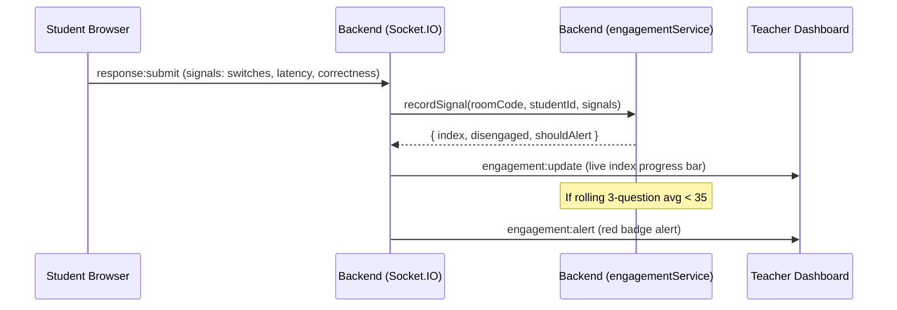

# Spandan Engagement Index (SEI) Design Document

---

## 1. Feature Overview & Problem Statement

In live virtual or hybrid classrooms, silent disengagement is a major challenge. Students who drift off, stop paying attention, or fail to participate remain invisible to the teacher during the class itself. Discovery of disengagement usually happens too late—after class, via poor test results or assignment grades.

**Spandan Engagement Index (SEI)** solves this by passively capturing real-time behavioral signals from students' quiz responses, computing a running engagement index (0–100) per student, and alerting the teacher when a student exhibits sustained disengagement.

---

## 2. Technical Architecture & Data Flows

The system relies on a passive, lightweight approach. No new buttons or active self-reporting are required from the student.



---

## 3. Scoring Model & Mathematical Formulation

For each question, a student receives a raw question score $S_q \in [0, 100]$ based on four weighted signals:

### 3.1. The 4 Weighted Signals

| Signal | Weight ($w_i$) | Calculation Metric | Description |
| :--- | :--- | :--- | :--- |
| **Participation** | 40% | $P = 1.0$ if answered, $0.0$ if skipped/timed out | Strongest indicator of active presence. Skipping a poll yields $S_q = 0$. |
| **Response Timing** | 25% | $T \in [0.1, 1.0]$ based on submission latency | Ratio $r = \frac{t_{\text{response}}}{t_{\text{timer}}}$. If $r \le 0.7$, $T = 1.0$. If $r > 0.7$, $T = \frac{1 - r}{0.3}$ (decays linearly to $0$). |
| **Decisiveness** | 15% | $D \in [0, 1.0]$ based on answer switches | If switches $s \le 1$, $D = 1.0$. If $s \ge 4$, $D$ decays. Formula: $D = 1 - \frac{s - 1}{3}$. |
| **Correctness** | 20% | $C = 1.0$ if correct, $0.4$ if incorrect | Rewards attempt and focus, even if the student did not get the answer correct. |

**Per-Question Score Formula:**
$$S_q = 100 \times \left( 0.40 \cdot P + 0.25 \cdot T + 0.15 \cdot D + 0.20 \cdot C \right)$$

### 3.2. Smoothing via Exponentially Weighted Moving Average (EWMA)

To prevent minor noise (such as one accidentally slow answer) from triggering false alarms, we smooth scores using EWMA:
$$\text{SEI}_n = \alpha \cdot S_{q, n} + (1 - \alpha) \cdot \text{SEI}_{n-1}$$
- **$\alpha = 0.4$** gives 40% weight to the latest question and 60% to past engagement history.
- The initial value $\text{SEI}_0$ is set directly to the student's first question score.

### 3.3. Disengagement & Alert Trigger

- **Window Size:** rolling 3-question window.
- **Alert Threshold:** 3-question rolling average $< 35$.
- **Episode-based Alerts:** Alert fires only **once** when the student transitions from engaged to disengaged. The alert flag resets when the average recovers to $\ge 35$.

---

## 4. Socket & REST Event Contracts

### 4.1. REST Endpoint: Member Retrieval
* **Route:** `GET /api/rooms/:id/members`
* **Headers:** `Authorization: Bearer <JWT>`
* **Role Required:** `teacher` (owner validation enforced)
* **Response:**
```json
{
  "studentIds": ["662f5b5f25a9b7001d7e2341", "662f5b5f25a9b7001d7e2342"]
}
```

### 4.2. Socket.IO Event: Response Submission
* **Event Name:** `response:submit`
* **Direction:** Client (Student) $\rightarrow$ Server
* **Payload:**
```json
{
  "roomCode": "ROOM123",
  "questionId": "662f5b5f25a9b7001d7e2343",
  "studentId": "662f5b5f25a9b7001d7e2341",
  "selectedOptions": [0],
  "responseTime": 6,
  "timerSeconds": 30,
  "answerSwitches": 1,
  "isCorrect": true,
  "studentName": "Karan Singhania"
}
```

### 4.3. Socket.IO Event: Live Updates
* **Event Name:** `engagement:update`
* **Direction:** Server $\rightarrow$ Room (Teacher Dashboard)
* **Payload:**
```json
{
  "studentId": "662f5b5f25a9b7001d7e2341",
  "studentName": "Karan Singhania",
  "index": 82,
  "disengaged": false
}
```

### 4.4. Socket.IO Event: Disengagement Alert
* **Event Name:** `engagement:alert`
* **Direction:** Server $\rightarrow$ Room (Teacher Dashboard)
* **Payload:**
```json
{
  "studentId": "662f5b5f25a9b7001d7e2341",
  "studentName": "Karan Singhania",
  "index": 28
}
```

### 4.5. Socket.IO Event: Non-Responder Timeout Penality
* **Event Name:** `question:end:engagement`
* **Direction:** Teacher Browser $\rightarrow$ Server (on timer zero)
* **Payload:**
```json
{
  "roomCode": "ROOM123",
  "nonResponderIds": ["662f5b5f25a9b7001d7e2342"]
}
```

---

## 5. Limitations & Edge Cases

1. **Network Latency:** Slow networks might inflate response latency. Linear decay of the timing score includes a 70% threshold window as a safeguard.
2. **Screen Sharing / Focus:** The system does not actively track tab switches (browser tab visibility API) in this version to preserve privacy, relying instead purely on input signals.
3. **Fail-safe isolation:** All scoring runs inside `try/catch` in the socket handler. Database saves and core real-time answer submissions will proceed unaffected even if scoring fails.

---

## 6. Academic References

1. **Fredricks, J. A., Blumenfeld, P. C., & Paris, A. H. (2004).** *School engagement: Potential of the concept, state of the evidence.* Review of Educational Research, 74(1), 59-109. (Establishes behavioral engagement framework).
2. **Baker, R. S., Corbett, A. T., Koedinger, K. R., & Wagner, A. Z. (2004).** *Off-task behavior in the cognitive tutor classroom: When students "game the system".* Proceedings of the SIGCHI Conference on Human Factors in Computing Systems. (Models guessing and off-task latency behaviors).
3. **Carini, R. M., Kuh, G. D., & Klein, S. P. (2006).** *Student engagement and student learning: Testing the linkages.* Research in Higher Education, 47(1), 1-32. (Demonstrates link between quick-feedback loops and learning gains).
