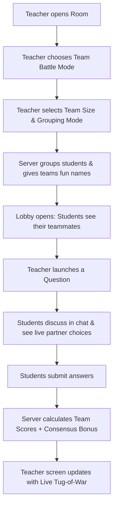

# Collaborative Team Battle Mode: Step-by-Step Build Guide

Welcome! In this guide, we are going to learn how to build the **Collaborative Team Battle Mode** (Think-Pair-Share) for Spandan. 

We wrote this guide so that a **Class 9 student** can read it, understand why this feature is awesome, and follow the exact steps to build the entire system from scratch.

---

## 📸 Pictorial Overview (How it Works)

Here is a visual overview of how Collaborative Team Battle Mode organizes the classroom, coordinates real-time student interaction, validates consensus, and displays the race to the finish line:


---

## 💻 Technical Working Pipeline

Here is the technical architectural pipeline of how data flows between the Teacher and Student frontends, the Express server, and the MongoDB database using REST APIs, Socket.io, and transaction scopes:


---

## 🌟 Part 1: Why We Built This Feature

Usually, when you play classroom quizzes, you sit by yourself, read a question, click an option, and hope you get it right. If you make a mistake, you might feel discouraged or get left behind.

**Team Battle Mode** changes that. Here is why it is better:

### 🧑‍🎓 For Students:
1. **Learn from Friends (Peer Tutoring)**: When you are grouped with teammates, you aren't alone. You can discuss *why* you think Option B is correct. If one student is a "topper" and another is a "slower reader," they can discuss and help each other learn.
2. **Consensus Bonus (1.5x Points)**: If your whole team agrees on the same correct answer, you get a huge score boost. This makes sure you talk and agree instead of just guessing.
3. **No Stress**: Competing as a team makes quizzes feel like a game tournament rather than a stressful exam.

### 👩‍🏫 For Teachers:
1. **Higher Engagement**: Instead of silent students staring at screens, the classroom becomes alive with discussion.
2. **Smart Grouping Control**: The teacher can group students randomly, let them choose their teams, or use **Mixed Performance Grouping** (the computer automatically pairs toppers and slower learners together).
3. **Live Tug-of-War**: The teacher gets a fun, moving dashboard showing which teams are winning, who has the longest streak, and who is working together best.

---

## 🧩 Part 2: The Big Picture (How it Works)

Spandan has two parts:
1. **The Backend (The Engine)**: Runs on the server. It keeps track of the database (who is in what team) and handles the messaging tubes (WebSockets) that let students talk in real time.
2. **The Frontend (The Dashboard)**: What the teacher and students see on their screens.

Here is the step-by-step game loop:


---

## 🛠️ Part 3: Step-by-Step Construction Guide

Let's build this system step-by-step!

### Step 1: The Database (Saving Teams)
We need a way for the database (MongoDB) to remember teams. We will create a new file named `Team.js` inside the backend models folder.

**Create File: `backend/src/models/Team.js`**
```javascript
import mongoose from 'mongoose'

const teamSchema = new mongoose.Schema({
  name: { type: String, required: true }, // Fun name, e.g., "Whisper Wizards"
  roomId: { type: mongoose.Schema.Types.ObjectId, ref: 'Room', required: true }, // Which room it belongs to
  members: [{ type: mongoose.Schema.Types.ObjectId, ref: 'User' }], // List of students on the team
  points: { type: Number, default: 0 }, // Total score
  streakCount: { type: Number, default: 0 }, // How many correct answers in a row
  avatar: { type: String, default: '🧙‍♂️' } // Team emoji
}, {
  timestamps: true
})

const Team = mongoose.model('Team', teamSchema)
export default Team
```

We also update `Room.js` to remember if a Team Battle is active. Add these settings inside the `settings` object of [Room.js](file:///c:/Users/ssaur/Desktop/span/spandan/backend/src/models/Room.js):
```javascript
teamBattleActive: { type: Boolean, default: false },
teamBattleConfig: {
  teamSize: { type: Number, default: 3 },
  groupingMode: { type: String, default: 'random' } // 'random', 'student-choice', or 'performance-mixed'
}
```

---

### Step 2: The Team Maker Service (The Math)
Now, we write the code that decides who goes into what team. We create `teamService.js`.

**Create File: `backend/src/services/teamService.js`**
```javascript
import Team from '../models/Team.js'
import RoomMember from '../models/RoomMember.js'
import Response from '../models/Response.js'

// Helper list of fun team names & emojis
const TEAM_NAMES = ['Whisper Wizards', 'Binary Beasts', 'Cyber Knights', 'Pixel Pirates', 'Code Cobras', 'Data Dragons']
const TEAM_EMOJIS = ['🧙‍♂️', '🦁', '⚔️', '🏴‍☠️', '🐍', '🐉']

export const createTeams = async (roomId, groupingMode, teamSize) => {
  // 1. Get all students currently in the room
  const memberships = await RoomMember.find({ roomId })
  const studentIds = memberships.map(m => m.studentId.toString())
  
  if (studentIds.length === 0) return []

  // Delete any old teams for this room
  await Team.deleteMany({ roomId })

  let sortedStudentIds = [...studentIds]

  if (groupingMode === 'performance-mixed') {
    // 2. MIXED PERFORMANCE ALGORITHM (Serpentine Sorting)
    // Find average score of each student
    const studentPerformance = await Promise.all(studentIds.map(async (id) => {
      const responses = await Response.find({ studentId: id })
      const correctCount = responses.filter(r => r.isCorrect).length
      const accuracy = responses.length > 0 ? (correctCount / responses.length) : 0.5 // default 50%
      return { id, accuracy }
    }))

    // Sort student list: best student (toppers) down to struggling students
    studentPerformance.sort((a, b) => b.accuracy - a.accuracy)
    sortedStudentIds = studentPerformance.map(sp => sp.id)
  } else if (groupingMode === 'random') {
    // RANDOM SHUFFLE
    sortedStudentIds.sort(() => Math.random() - 0.5)
  }

  // 3. Distribute students into teams
  const numTeams = Math.max(1, Math.ceil(sortedStudentIds.length / teamSize))
  const teamsData = Array.from({ length: numTeams }, (_, i) => ({
    name: TEAM_NAMES[i % TEAM_NAMES.length] + ' ' + (Math.floor(i / TEAM_NAMES.length) + 1),
    avatar: TEAM_EMOJIS[i % TEAM_EMOJIS.length],
    roomId,
    members: []
  }))

  if (groupingMode === 'performance-mixed') {
    // Serpentine distribution: Team 1, Team 2, Team 3... then Team 3, Team 2, Team 1
    let forward = true
    let teamIdx = 0
    for (const studentId of sortedStudentIds) {
      teamsData[teamIdx].members.push(studentId)
      if (numTeams > 1) { // Guard against index out-of-bounds crash if there is only 1 team
        if (forward) {
          teamIdx++
          if (teamIdx >= numTeams) { teamIdx = numTeams - 1; forward = false; }
        } else {
          teamIdx--
          if (teamIdx < 0) { teamIdx = 0; forward = true; }
        }
      }
    }
  } else {
    // Standard chunking
    sortedStudentIds.forEach((studentId, index) => {
      const teamIdx = index % numTeams
      teamsData[teamIdx].members.push(studentId)
    })
  }

  // Save new teams to MongoDB
  const savedTeams = await Team.insertMany(teamsData)
  return savedTeams
}
```

---

### Step 3: Real-Time Sockets (Communicating Sockets)
WebSockets are like phone lines that let student devices talk to the server instantly. We will modify `backend/src/index.js` to listen for new team phone calls.

**Modify File: `backend/src/index.js`**
Add these listeners inside the `io.on('connection')` block:
```javascript
  // 1. Join a team socket channel
  socket.on('team:join_channel', ({ teamId }) => {
    socket.join(`team:${teamId}`)
    console.log(`Socket ${socket.id} joined team channel team:${teamId}`)
  })

  // 2. Ephemeral Chat (Not saved to DB, just broadcasted immediately)
  socket.on('team:message', ({ teamId, studentName, text }) => {
    io.to(`team:${teamId}`).emit('team:message_received', {
      studentName,
      text,
      timestamp: new Date().toLocaleTimeString()
    })
  })

  // 3. Selection Syncing (Shows partners what option you are hovering/clicking)
  socket.on('team:select_option', ({ teamId, studentId, selectedOption }) => {
    socket.to(`team:${teamId}`).emit('team:partner_selected', {
      studentId,
      selectedOption
    })
  })
```

---

### Step 4: The Consensus Scoring Logic
When students submit their answers, the server checks if the team reached consensus and calculates the points.

Add consensus calculations to the `response:submit` socket callback in `index.js`:
```javascript
  socket.on('response:submit', async (data) => {
    const mongoose = (await import('mongoose')).default
    const Team = (await import('./models/Team.js')).default
    const Response = (await import('./models/Response.js')).default

    // Start a transaction session to prevent race conditions during concurrent submissions
    const session = await mongoose.startSession()
    session.startTransaction()
    try {
      const team = await Team.findOne({ roomId: data.roomId, members: data.studentId }).session(session)
      if (team) {
        // Get all responses submitted by teammates for the current question
        const teammateResponses = await Response.find({ 
          roomId: data.roomId, 
          questionId: data.questionId,
          studentId: { $in: team.members } 
        }).session(session)

        // Check if ALL members answered and selected the EXACT same option index
        const allAnswered = teammateResponses.length === team.members.length
        const allSelectedSame = teammateResponses.every(r => r.selectedOption === teammateResponses[0].selectedOption)
        
        let finalPoints = data.points
        let consensusBonusTriggered = false

        if (allAnswered && allSelectedSame && teammateResponses[0].isCorrect) {
          // Apply 1.5x Consensus Multiplier!
          finalPoints = Math.round(finalPoints * 1.5)
          consensusBonusTriggered = true
        }

        // Add points to team total atomically and fetch the updated point score
        const updatedTeam = await Team.findByIdAndUpdate(
          team._id,
          { $inc: { points: finalPoints } },
          { new: true, session }
        )

        await session.commitTransaction()

        // Broadcast verified score using the socket's authenticated roomCode
        io.to(socket.roomCode).emit('team:score_updated', {
          teamId: team._id,
          points: updatedTeam.points,
          consensusBonus: consensusBonusTriggered
        })
      }
    } catch (error) {
      await session.abortTransaction()
      console.error('Team submission transaction aborted:', error)
    } finally {
      session.endSession()
    }
  })
```

---

### Step 5: The Frontend Dashboards (What They See)

Now let's build the interactive displays.

#### 1. Student Discussion & Live Choice Overlay
When a question begins, the student screen changes to the **Team Canvas**. Instead of a plain question, it shows what teammates are doing.

**Create File: `frontend/src/components/TeamDiscussionCanvas.jsx`**
```jsx
import React, { useState, useEffect } from 'react'
import io from 'socket.io-client'

export default function TeamDiscussionCanvas({ question, team, student, socket }) {
  const [messages, setMessages] = useState([])
  const [inputText, setInputText] = useState('')
  const [partnerChoices, setPartnerChoices] = useState({}) // studentId -> selectedOptionIndex
  const [myChoice, setMyChoice] = useState(null)

  useEffect(() => {
    // Join the team WebSocket channel
    socket.emit('team:join_channel', { teamId: team._id })

    // Listen for partner clicks
    socket.on('team:partner_selected', ({ studentId, selectedOption }) => {
      setPartnerChoices(prev => ({ ...prev, [studentId]: selectedOption }))
    })

    // Listen for chat messages
    socket.on('team:message_received', (msg) => {
      setMessages(prev => [...prev, msg])
    })

    return () => {
      socket.off('team:partner_selected')
      socket.off('team:message_received')
    }
  }, [team._id, socket])

  const handleOptionClick = (idx) => {
    setMyChoice(idx)
    socket.emit('team:select_option', {
      teamId: team._id,
      studentId: student._id,
      selectedOption: idx
    })
  }

  const sendMessage = () => {
    if (!inputText.trim()) return
    socket.emit('team:message', {
      teamId: team._id,
      studentName: student.name,
      text: inputText
    })
    setInputText('')
  }

  return (
    <div style={{ display: 'flex', gap: '20px', padding: '20px', fontFamily: 'sans-serif' }}>
      {/* LEFT: Question and Teammate Choices */}
      <div style={{ flex: 2, background: '#1e2530', color: 'white', padding: '20px', borderRadius: '12px' }}>
        <h2>Team: {team.avatar} {team.name}</h2>
        <h3>Question: {question.text}</h3>
        
        <div style={{ display: 'flex', flexDirection: 'column', gap: '10px', marginTop: '20px' }}>
          {question.options.map((opt, idx) => (
            <button 
              key={idx} 
              onClick={() => handleOptionClick(idx)}
              style={{
                padding: '15px',
                borderRadius: '8px',
                border: 'none',
                background: myChoice === idx ? '#4f46e5' : '#2d3748',
                color: 'white',
                fontSize: '16px',
                cursor: 'pointer',
                textAlign: 'left'
              }}
            >
              {opt.text}
              {/* Show which teammate clicked this option */}
              <div style={{ display: 'inline-block', marginLeft: '10px' }}>
                {Object.entries(partnerChoices)
                  .filter(([_, chosenOpt]) => chosenOpt === idx)
                  .map(([partnerId]) => (
                    <span key={partnerId} style={{ background: '#10b981', padding: '3px 8px', borderRadius: '12px', fontSize: '12px', marginLeft: '5px' }}>
                      👤 Partner
                    </span>
                  ))}
              </div>
            </button>
          ))}
        </div>
      </div>

      {/* RIGHT: Live Discussion Chat Box */}
      <div style={{ flex: 1, background: '#f7fafc', border: '1px solid #e2e8f0', borderRadius: '12px', display: 'flex', flexDirection: 'column', height: '400px' }}>
        <div style={{ background: '#e2e8f0', padding: '10px', borderTopLeftRadius: '12px', borderTopRightRadius: '12px', fontWeight: 'bold' }}>💬 Team Chat (Ephemeral)</div>
        <div style={{ flex: 1, padding: '10px', overflowY: 'scroll' }}>
          {messages.map((m, idx) => (
            <div key={idx} style={{ margin: '5px 0' }}>
              <strong>{m.studentName}:</strong> {m.text}
            </div>
          ))}
        </div>
        <div style={{ display: 'flex', borderTop: '1px solid #e2e8f0' }}>
          <input 
            type="text" 
            value={inputText} 
            onChange={(e) => setInputText(e.target.value)} 
            placeholder="Type message..." 
            style={{ flex: 1, border: 'none', padding: '10px', borderBottomLeftRadius: '12px' }}
          />
          <button 
            onClick={sendMessage} 
            style={{ background: '#4f46e5', color: 'white', border: 'none', padding: '10px 20px', borderBottomRightRadius: '12px', cursor: 'pointer' }}
          >
            Send
          </button>
        </div>
      </div>
    </div>
  )
}
```

---

#### 2. Teacher Screen: Team Tug-of-War Leaderboard
Instead of displaying a boring list of names, the teacher projects a dynamic **Tug-of-War** screen in the classroom. This is simple, responsive, and uses smooth HTML/CSS transitions.

**Create File: `frontend/src/components/TeamTugOfWar.jsx`**
```jsx
import React from 'react'

export default function TeamTugOfWar({ teams }) {
  // Sort teams so the leading team is displayed on top
  const sortedTeams = [...teams].sort((a, b) => b.points - a.points)
  const maxPoints = Math.max(...teams.map(t => t.points), 100) // avoid divide by zero

  return (
    <div style={{ padding: '30px', background: '#0f172a', color: 'white', minHeight: '80vh', borderRadius: '16px' }}>
      <h1 style={{ textAlign: 'center', margin: '0 0 40px 0', fontSize: '32px' }}>🏁 Live Team Tug-Of-War</h1>
      
      <div style={{ display: 'flex', flexDirection: 'column', gap: '30px' }}>
        {sortedTeams.map((team, idx) => {
          const percentage = Math.min(100, Math.round((team.points / maxPoints) * 100))
          
          return (
            <div key={team._id} style={{ display: 'flex', alignItems: 'center', gap: '20px' }}>
              {/* Rank Position */}
              <div style={{ width: '40px', fontSize: '24px', fontWeight: 'bold', color: '#94a3b8' }}>#{idx + 1}</div>
              
              {/* Team Name Card */}
              <div style={{ width: '220px', background: '#1e293b', padding: '15px', borderRadius: '10px', borderLeft: '5px solid #6366f1' }}>
                <span style={{ fontSize: '24px', marginRight: '10px' }}>{team.avatar}</span>
                <span style={{ fontSize: '18px', fontWeight: 'bold' }}>{team.name}</span>
              </div>
              
              {/* Tug-of-War Racing Lane */}
              <div style={{ flex: 1, background: '#1e293b', height: '24px', borderRadius: '12px', overflow: 'hidden', position: 'relative' }}>
                <div 
                  style={{ 
                    width: `${percentage}%`, 
                    background: 'linear-gradient(90deg, #4f46e5, #06b6d4)', 
                    height: '100%', 
                    borderRadius: '12px',
                    transition: 'width 1s ease-in-out',
                    position: 'relative'
                  }}
                >
                  {/* Fire element on streak */}
                  {team.streakCount >= 3 && (
                    <span style={{ position: 'absolute', right: '10px', top: '-2px', fontSize: '18px', animation: 'pulse 1s infinite' }}>🔥</span>
                  )}
                </div>
              </div>

              {/* Score Value */}
              <div style={{ width: '120px', textAlign: 'right', fontSize: '22px', fontWeight: 'bold', color: '#34d399' }}>
                {team.points} pts
              </div>
            </div>
          )
        })}
      </div>
    </div>
  )
}
```

---

## 🛡️ Part 5: Comprehensive Input Validation & Edge Case Rules

To make sure our application does not crash, leak information, or allow students to cheat, we must write strict rules (validations) for every action. Here is the complete list of conditions:

### 1. REST API Config Validation (Zod Schemas)
When the teacher starts or updates the Team Battle configuration, the server validates the incoming data using these strict conditions:
*   `teamSize`:
    *   **Rule**: Must be a positive integer.
    *   **Minimum Limit**: `2` (You cannot have a team of 1 student, as that is not a team!).
    *   **Maximum Limit**: `50` (A team cannot be too large, otherwise students cannot collaborate).
    *   **Error Message**: `"Team size must be between 2 and 50."`
*   `groupingMode`:
    *   **Rule**: Must be a string.
    *   **Allowed Values**: Only `'random'`, `'student-choice'`, or `'performance-mixed'`.
    *   **Error Message**: `"Invalid grouping mode selected."`

### 2. Team Service Grouping Edge Cases & Math Rules
When the server splits students into teams, it must follow these safety conditions:
*   **Condition A: No Students in Room**
    *   *If* total students in room is `0`.
    *   *Action*: Stop execution and return error: `"Cannot start Team Battle. No students have joined the room yet."`
*   **Condition B: Fewer Students than Team Size**
    *   *If* total students is less than the selected `teamSize` (e.g. 2 students joined, but team size is set to 3).
    *   *Action*: Automatically override `teamSize` to match the total number of students. Create exactly **one team** containing all students.
*   **Condition C: Leftover/Solitary Student Correction**
    *   *Problem*: If there are 5 students and `teamSize` is 3, the normal split makes Team A (3 students) and Team B (2 students) - this is fine. But if there are 5 students and `teamSize` is 4, it makes Team A (4 students) and Team B (1 student). A team of 1 student is not allowed!
    *   *Rule*: No team can have a size of `1`.
    *   *Action*: If any generated team has only `1` member, that student is automatically merged into another active team, so that **every team has at least 2 members**.
*   **Condition D: Mixed Performance Serpentine Sorting Math**
    *   *Step 1*: Rank students by accuracy (from 1st place down to last place).
    *   *Step 2*: If we need $N$ teams, distribute students in a "snake-like" (serpentine) path:
        *   Student 1 ➡️ Team 1
        *   Student 2 ➡️ Team 2
        *   ...
        *   Student $N$ ➡️ Team $N$
        *   Student $N+1$ ➡️ Team $N$ (Goes backward!)
        *   Student $N+2$ ➡️ Team $N-1$
    *   *Benefit*: This guarantees that the sum of skills on every team is mathematically balanced, pairing the top student with the lowest-performing student.

### 3. WebSocket Event Validations
When students send messages or submit answers, the server checks these safety conditions on every packet:
*   **Condition E: Socket Chat Spam Check (`team:message`)**
    *   *teamId*: Must be a valid 24-character hexadecimal MongoDB ObjectId string.
    *   *text*: Must be a string. Minimum length is `1` character (no empty messages). Maximum length is `200` characters (prevents sending massive text spam to crash teammate screens).
    *   *XSS Clean*: The server sanitizes the text by removing `<script>` and HTML tags to prevent security issues.
    *   *Team Verification*: The server checks the database to verify that the student sending the socket message is **actually a registered member** of that team. If not, the packet is ignored.
*   **Condition F: Option Click Sync Validation (`team:select_option`)**
    *   *teamId*: Valid MongoDB ObjectId string.
    *   *selectedOption*: Must be an integer. It must be greater than or equal to `0`, and less than the total number of options in the active question (e.g. if the question has 4 choices, `selectedOption` must be between `0` and `3`).
    *   *Team Verification*: The server checks that the sender belongs to the team.

### 4. Consensus scoring Check
*   When a student submits, the server increments their submission.
*   *If* the number of submitted responses from a team equals the total number of members in that team:
    *   Check if all members chose the **exact same option index**.
    *   *If* they all chose the same option, and it is the correct answer:
        *   Apply **1.5x points multiplier** to the team score.
        *   Emit a socket event `team:consensus_success` to trigger a green flashing celebration on teammate dashboards.
        *   Increment team streak count by `1`.
    *   *Else* (if they chose different options, or agreed on the wrong answer):
        *   Reset the team streak count to `0`.
        *   Give normal individual points (no multiplier) to members who got it right.

---

## 🔒 Part 6: Advanced Security Safeguards & Resilient Logic

To prevent cheating, system hacking, or bugs when players disconnect or submit answers at the exact same millisecond, we must implement these **advanced safeguards**:

### 1. 🛡️ Broken Object Level Authorization (`team:join_channel`)
*   **The Risk**: A student could modify their client-side code to guess another team's `teamId` and join their Socket channel. This would allow them to spy on the opponent's chat and copy their answers in real-time.
*   **The Guard**:
    *   When the server receives a `team:join_channel` request, it *must verify* the student's ID against the database.
    *   It checks the `Team` collection in MongoDB to ensure the authenticated user's ID is explicitly listed in the `members` array for that `teamId`. If the student is not a registered member of that team, the connection is dropped and access is denied.

### 2. 🧮 Zero-Trust Scoring (Never Trust Client Points)
*   **The Risk**: If the student's device sends the points count (e.g., `data.points`), a student could hijack the packet and inject fake points (like sending `999,999` points).
*   **The Guard**:
    *   The server uses a **Zero-Trust** model. Points are calculated *entirely on the server-side*.
    *   The backend retrieves the active question's max points and `timeToAnswer` from the database. It then measures the time elapsed from when the question started until the submission packet was received, computes the decay factor, checks the correct answer key in Mongoose, and assigns points. The client has zero control over points injection.

### 3. 🚦 Token-Bucket Socket Rate Limiting
*   **The Risk**: A student could write a script that sends thousands of socket messages (`team:message` or `team:select_option`) per second. This spamming would crash teammate screens and deny service to the class.
*   **The Guard**:
    *   Each student socket is assigned a token bucket on the server.
    *   The bucket allows a maximum of 5 events per second. Each event consumes a token. If the bucket runs dry, the server immediately throttles/drops the incoming requests and emits a `rate_limit_exceeded` warning to the client.

### 4. ⚡ Database Race Condition Prevention
*   **The Risk**: When 3 teammates click submit at the exact same millisecond, the server attempts to read and write the team score concurrently. This causes a "race condition" where updates overwrite each other, and consensus bonuses get lost or dropped.
*   **The Guard**:
    *   The score updates use **Mongoose atomic operators** (such as `$inc` for incremental adjustments) instead of reading and saving.
    *   For calculating consensus, the database uses atomic operations or transactions (`session.startTransaction()`) to evaluate the completion state safely, guaranteeing that no updates are lost.

### 5. 🧹 Strict Orphan-Team Cleanup
*   **The Risk**: Standard division algorithms can accidentally leave a team with only 1 player (an "orphan" team) if the group counts are uneven.
*   **The Guard**:
    *   At the tail-end of the team distribution service layer, the code loops through the list of generated teams.
    *   If any team has a `members.length < 2`, it is immediately dissolved. That single member is pushed into the smallest existing team, ensuring a clean re-balanced array with **zero orphan teams of size 1**.

### 6. 🔌 Mid-Game Dropout Resilience
*   **The Risk**: If a student drops connection or closes their browser tab, their team (e.g. size of 3) is down to 2 active players. Because the server waits for 3 responses before calculating consensus, the remaining players can never score the Consensus Bonus!
*   **The Guard**:
    *   The active member count is calculated dynamically against **currently connected socket rooms**.
    *   *Alternative*: If a student is disconnected for more than 45 seconds, the server automatically removes them from the active team members list for scoring purposes, allowing the remaining team members to reach consensus and continue playing smoothly.

### 7. 🔒 Post-Submission Button Lock
*   **The Risk**: If a student clicks an option and submits it, but the button remains active, they can click other buttons. This creates a visual "desync" between what is on their screen and the scores recorded in the backend.
*   **The Guard**:
    *   In the React frontend, the moment a student clicks a choice or submits, we set `disabled={true}` on all answer buttons immediately, locking the user interface and preventing double clicks.

### 8. 🚪 Late-Joiner Team Catch-all
*   **The Risk**: If a student joins the classroom late (after the teams have already been formed by the teacher), they will have no `teamId` and will be locked out of playing the game loop.
*   **The Guard**:
    *   When the server receives a `room:join` socket event, if team battle mode is active, it runs a check: does this student belong to any team?
    *   If the student lacks a `teamId`, the server executes a fallback algorithm that dynamically assigns them to the team with the fewest active members, sending them their team details instantly.

### 9. 🔍 MongoDB ObjectId Safety Guards
*   **The Risk**: If a malicious client sends malformed or random text/objects instead of a valid 24-character hex ID (e.g., `teamId: { "$gt": "" }`), database queries will throw a fatal casting error or bypass checks.
*   **The Guard**:
    *   Before executing any Mongoose database query inside our Socket listeners, the server checks the type and validity of the parameters:
    *   `if (typeof teamId !== 'string' || !mongoose.Types.ObjectId.isValid(teamId)) { return socket.emit('error', 'Malformed parameters'); }`

### 10. 🛡️ Socket Room Spoofing Protection
*   **The Risk**: Students could alter client variable parameters to target a different classroom, emitting fake score updates or broadcasting messages into other rooms.
*   **The Guard**:
    *   The server *never* broadcasts to channels using variables passed inside the client payload (e.g., trust-free `io.to(data.roomId)`).
    *   Keep room channels tied to session details:
    *   `io.to(socket.roomId)` or `io.to(socket.roomCode)` inside socket callbacks.

---

## 🏆 Part 7: Success Verification Check

How do we check if we built it correctly? Follow these easy tests:

1. **Verify Database Entries**:
   * Open MongoDB Compass.
   * Verify that when a teacher starts Team Battle Mode, the collections populate with the correct fields under `teams` schema.
2. **Verify Grouping Diversity**:
   * Create a classroom room with 6 students (3 high accuracy toppers, 3 lower accuracy students).
   * Choose **Mixed Grouping Mode** with a group size of 2.
   * Verify that each of the 3 resulting teams contains exactly **one topper and one lower accuracy student**.
3. **Verify Sockets**:
   * Open Student A and Student B on side-by-side browser windows.
   * When Student A clicks option 2 on the question card, confirm that Student B's screen instantly displays a `👤 Partner` avatar overlay tag on Option 2.
4. **Verify Consensus Score boost**:
   * Submit the correct answer for both Student A and Student B (the whole team).
   * Confirm that the team score rises by **150 points** (100 base points x 1.5 consensus multiplier).

---

## 🔒 Part 8: Proctored Fullscreen Poll Lock (OA-Style Exam Portal)

In addition to Team Battle Mode, PR #63 introduces an **Online Assessment (OA)-style Proctored Fullscreen Lock** for standard live polls (similar to TCS iON / Mettl / Hackerrank exam portals).

### 🌟 Key Capabilities:

1. **OS-Level Fullscreen Enforcement**:
   - Forces the student browser into real OS-level fullscreen mode (`requestFullscreen()`) when a live question starts.
   - **Entry Gate Screen**: Renders a dedicated entry screen requiring an explicit click to enter the locked test environment (conforming to browser security policy).

2. **Real-time Violation Detection & Tracking**:
   - **ESC Key Exit Detection**: If a student exits fullscreen using ESC or browser controls, the system immediately forces re-entry into fullscreen and logs a security violation.
   - **Tab Switch Detection**: Listens to `visibilitychange` (`hidden` state) to detect when a student switches tabs or minimizes the window.
   - **Window Blur Detection**: Detects when the browser window loses focus (`blur`).
   - **Violation HUD Bar & Warning Toast**: Displays a top status bar with real-time violation count (`⚠️ Violations: X/3`) and flashes red warning toasts.

3. **Auto-Submit Penalty Threshold**:
   - When the violation count hits the threshold (default: 3 violations), the system triggers an automatic force-submission (`onForceSubmit`), locking in the current selection or submitting blank.

4. **Teacher Socket Alerts**:
   - Emits `proctor:violation` via Socket.IO to the backend, which forwards `proctor:violation_alert` to the teacher's room channel in real time.

5. **Shortcut & Developer Tools Blocking**:
   - Blocks right-click context menu (`contextmenu`).
   - Blocks keyboard inspection shortcuts (`F12`, `Ctrl+Shift+I`, `Ctrl+Shift+J`, `Ctrl+Shift+C`, `Ctrl+U`).

6. **Automatic Release & Mode Scope**:
   - Exits fullscreen automatically upon answer submission or question completion.
   - Automatically bypassed during Collaborative Team Battle Mode to preserve discussion canvas usability.

---

## 📋 Part 9: Complete Summary of Pull Request #63

| Feature Component | Implementation Details | Files Changed |
|---|---|---|
| **Proctored Fullscreen Lock** | Entry gate, OS fullscreen request, ESC/Tab-switch/Blur detection, 3-strike auto-submit, shortcut blocking, teacher alerts | `frontend/src/components/FullscreenLock.jsx`, `frontend/src/pages/StudentRoomPage.jsx`, `backend/src/index.js` |
| **Team Battle Mode** | Team models, serpentine & random grouping, student choice mode with join/leave controls, consensus 1.5x scoring, ephemeral chat, option sync, tug-of-war leaderboard | `backend/src/models/Team.js`, `backend/src/models/Room.js`, `backend/src/services/teamService.js`, `backend/src/routes/teams.js`, `frontend/src/components/TeamLobby.jsx`, `frontend/src/components/TeamDiscussionCanvas.jsx`, `frontend/src/components/TeamTugOfWar.jsx`, `frontend/src/components/TeamBattleSetup.jsx`, `frontend/src/stores/teamStore.js` |
| **Socket & Reconnection Resilience** | Auto room re-join on socket reconnect, team channel re-join, token bucket rate limiting, zero-trust points, atomic transactions | `frontend/src/stores/socketStore.js`, `backend/src/index.js` |
| **Dynamic Routing & Dev Server** | Dynamic `BASE_PATH` handling for local dev root `/` vs production `/spandan` | `frontend/src/config.js`, `frontend/src/App.jsx` |
| **Documentation & Diagrams** | Architectural guides, pipeline flowcharts, database schemas, test logs | `myfeature.md`, `mycontext.md`, `product.md`, `bug.md`, `team_battle_overview.png`, `team_battle_pipeline.png` |
